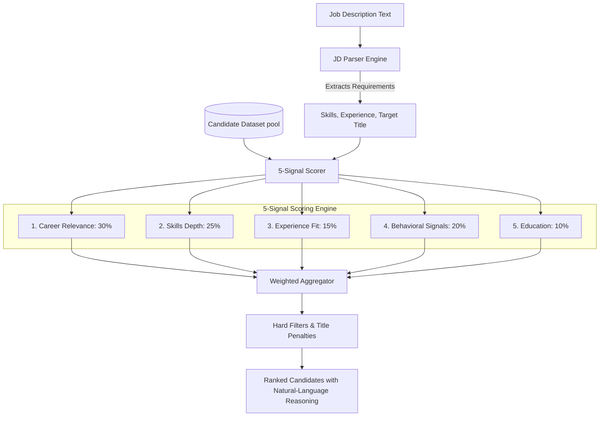

# SkillSync — 5-Signal AI Candidate Scoring Methodology

> **Track 1 | INDIA RUNS Hackathon by Redrob**  
> A detailed breakdown of the scoring models, algorithms, and mathematical structures behind the SkillSync Candidate Discovery & Ranking Engine.

---

## 📌 Introduction & Problem Statement

Traditional Applicant Tracking Systems (ATS) rely on simple keyword-matching filters. If a job description (JD) asks for **"Python"**, a candidate who stuffed the keyword ten times in their resume gets the same score as an industry veteran who built distributed Python backends for five years. This approach leads to:
1. **False Positives**: Candidate profiles optimized for keywords but lacking deep practical knowledge.
2. **False Negatives**: Highly qualified experts with clean, concise resumes who omit keyword clusters.
3. **Out-of-Context Matching**: Overlooking behavioral cues (e.g., active job-seeking status, responsiveness) and career trajectories.

**SkillSync** implements a multi-dimensional, **5-signal weighted scoring model** that evaluates career relevance, skill depth (backed by proctored assessments), behavioral responsiveness, experience tolerances, and education tiers.

---

## 🏗️ Architectural Overview



---

## 🧬 Detailed 5-Signal Model Breakdown

The engine evaluates every candidate profile against a target JD across five independent dimensions.

```
Total Base Score = (Career × 0.30) + (Skills × 0.25) + (Experience × 0.15) + (Behavioral × 0.20) + (Education × 0.10)
```

---

### 🏢 Signal 1: Career Relevance (30% Weight)

This signal determines whether the candidate's professional trajectory and company backgrounds align with the role requirements.

#### A. Tech vs. Non-Tech Routing
The system automatically classifies the JD type:
* **Tech JD**: Either contains extracted tech skills or matches tech keywords (e.g., *ML, AI, developer, fullstack*).
* **Non-Tech JD**: Evaluated primarily via title-word overlap ratio against the candidate's current job title.

#### B. Tech Career Scoring Rules
For Tech JDs, the base career relevance score starts at **0.5** and is dynamically adjusted:

| Adjustment Criteria | Impact | Rationale / Detail |
|---|---|---|
| **Bad Title Penalty** | `-0.4` | Current title contains keywords like *marketing, sales, HR, operations, customer support, accountant, recruiter, talent acquisition*. |
| **Good Title Bonus** | `+0.2` | Current title contains words like *engineer, developer, scientist, researcher, architect, lead, principal, ML, AI*. |
| **Product Company Bonus** | `+0.08` | For every career history entry at a top product firm (e.g., *Google, Microsoft, Swiggy, Zoho, PhonePe, CRED, OpenAI*). |
| **Consulting Firm Penalty** | `-0.25` | If **>80%** of total career months were spent at body-shopping firms (e.g., *TCS, Infosys, Wipro, Accenture, Cognizant*). |
| **Consulting Firm Partial Penalty** | `-0.10` | If **50% to 80%** of career months were spent at consulting firms. |
| **Product Depth Bonus** | `+0.10` | Total duration spent at product startups/companies exceeds **24 months**. |
| **Keyphrase Domain Matches** | `+0.05` | Role descriptions containing phrases like *ranking, retrieval, recommendation, search, embeddings, NLP, RAG, vector*. |

> [!IMPORTANT]
> The final Career Relevance score is tightly bounded:
> $$\text{Career Relevance Score} = \max(0.0, \min(1.0, \text{Score}))$$

---

### 🔧 Signal 2: Skills Depth (25% Weight)

Rather than checking for the presence of a keyword, SkillSync scores each matching skill on four dimensions to determine true capability.

For every skill required by the JD that the candidate possesses:
$$\text{Individual Skill Score} = \text{Proficiency} + \text{Endorsement Bonus} + \text{Duration Bonus} + \text{Exam Bonus}$$

| Dimension | Value Range | Logic |
|---|---|---|
| **Proficiency Score** | `0.2` to `1.0` | `beginner` = 0.2, `intermediate` = 0.5, `advanced` = 0.8, `expert` = 1.0. |
| **Endorsement Bonus** | `0` to `0.3` | Linear scale up to 50 endorsements: $\min(\text{endorsements} / 50, 0.3)$ |
| **Duration Bonus** | `0` to `0.2` | Linear scale up to 48 months of use: $\min(\text{duration\_months} / 48, 0.2)$ |
| **Exam Bonus** | `0` to `0.3` | Score from SkillSync's proctored assessment: $(\text{exam\_score} / 100) \times 0.3$ |

> [!TIP]
> **Proctored Exams are the ultimate tiebreaker.** A candidate listing intermediate Python but carrying a verified 95% score on our proctored exam will rank higher than a candidate claiming expert Python with no test history.

#### Breadth & Score Aggregation
The overall skills score combines the average quality of matching skills with a **breadth bonus** for matching multiple required skills:
$$\text{Skills Score} = \min\left( \left(\frac{\sum \text{Individual Skill Scores}}{N_{\text{relevant}} \times 1.5}\right) \times 0.7 + \min\left(\frac{N_{\text{relevant}}}{10}, 0.3\right), 1.0 \right)$$
* If a candidate matches **0** required skills, the score drops to a baseline of `0.05` (for Tech JDs) or `0.5` (for Non-Tech JDs).

---

### 📅 Signal 3: Experience Fit (15% Weight)

SkillSync values target alignment over raw tenure. A 15-year veteran is often overqualified and a high churn risk for a role requesting 2 years of experience.

The JD parser extracts the target experience range (e.g., `"3 to 5 years"` $\rightarrow \text{midpoint} = 4.0$).

$$\text{Experience Score} = \max\left(0.1, 1.0 - \left(\frac{|\text{Candidate Years} - \text{Target Midpoint}|}{\max(\text{Target Midpoint}, 5.0)}\right) \times 0.8\right)$$

---

### ⚡ Signal 4: Behavioral Signals (20% Weight)

This signal predicts hiring success by evaluating real-world availability, platform activity, and engagement records.

The base score begins at **0.3** and is adjusted as follows:

* **Open to Work**: `+0.25` (shows direct intent).
* **Recruiter Response Rate**: `+ (Rate * 0.2)` (active replier indicator).
* **Recency of Activity**:
  * Active within $\le 30$ days: `+0.15`
  * Active within $31 - 90$ days: `+0.08`
  * Inactive for $> 365$ days: `-0.15` (ghost risk).
* **GitHub Activity Footprint**: `+ (GitHub Score / 100) * 0.1` (verified coding logs).
* **Interview Attendance Rate**: `+ (Completion Rate * 0.05)` (reliability indicator).
* **Short Notice Period**: `+0.05` (notice period $\le 30$ days).
* **In-Demand Status**: `+0.05` (saved by $> 5$ recruiters in last 30 days).

---

### 🎓 Signal 5: Education (10% Weight)

Evaluates academic background without over-indexing on credentials. The score defaults to **0.3** and is computed based on the candidate's highest degree:

$$\text{Education Score} = \max(\text{Previous}, \min(\text{Tier Score} + \text{Field Bonus} + \text{Degree Bonus}, 1.0))$$

* **Institution Tier**: Tier 1 = `1.0`, Tier 2 = `0.8`, Tier 3 = `0.6`, Tier 4 = `0.4`.
* **Field Bonus**: `+0.2` if study field is *Computer Science, Software, Data Science, AI, Math, or Statistics*.
* **Degree Bonus**:
  * `+0.2` for *Ph.D., M.S., or M.Tech*.
  * `+0.1` for *B.Tech or B.E.*.

---

## 🚫 Hard Filters & Gatekeepers

To ensure candidate lists contain high-signal matches, the engine applies immediate overrides before sorting:

> [!WARNING]
> **Tech JD Hard Gatekeepers:**
> 1. **Bad Title Match**: If a candidate carries a bad title keyword (e.g., *HR Manager* applying for *ML Engineer*), their score is set directly to **`0.0`**.
> 2. **Zero Matching Skills**: If a Tech JD has required skills and the candidate matches **0** of them, their score is set directly to **`0.0`**.

> [!CAUTION]
> **Non-Tech JD Multiplicative Penalties:**
> * If a candidate applying for a non-tech role carries a bad title keyword, the score receives a strict **`0.15`** multiplier:
> $$\text{Final Score} = \text{Base Aggregated Score} \times 0.15$$

---

## 💬 Explainability & Natural-Language Reasoning

SkillSync generates human-readable reasoning narratives alongside numerical scores. 

* **Career Fit Snippets**: e.g., *"strong career fit (title & history align well)"* or *"⚠️ title mismatch — role does not align with JD"*.
* **Skill Match Snippets**: e.g., *"3 required skills matched at high proficiency (Python, PyTorch, LLMs)"*.
* **Experience Fit Snippets**: e.g., *"11.3 yrs experience closely matches JD target"*.
* **Engagement Snippets**: e.g., *"actively open to work, 86% recruiter response rate"*.

Recruiters are provided full visibility into why the candidate was placed at their rank, eliminating "black-box" AI issues.

---

## 📊 Keyword Matching vs. SkillSync 5-Signal Matching

| Feature | Keyword Matching ATS | SkillSync 5-Signal Scorer |
|---|---|---|
| **Handles Skill Proficiencies** | ❌ Treat all mentions equally | ✅ Weighs Beginner vs. Expert levels |
| **Assesses Verification** | ❌ Accepts self-declared lists | ✅ Adds bonus for Proctored Exams |
| **Contextualizes Career History** | ❌ Checks keyword strings only | ✅ Weighs Product vs. Consulting ratios |
| **Respects Experience Windows** | ❌ More years always ranks higher | ✅ Computes target window variance |
| **Applies Behavioral Recency** | ❌ Stale profiles ranked identically | ✅ Rewards active candidates & fast notice |
| **Prevents Spammer Fits** | ❌ Spammers occupy top results | ✅ Hard title gatekeepers filter bad profiles |
| **Recruiter Explainability** | ❌ None | ✅ Per-signal graphs and text reasoning |
